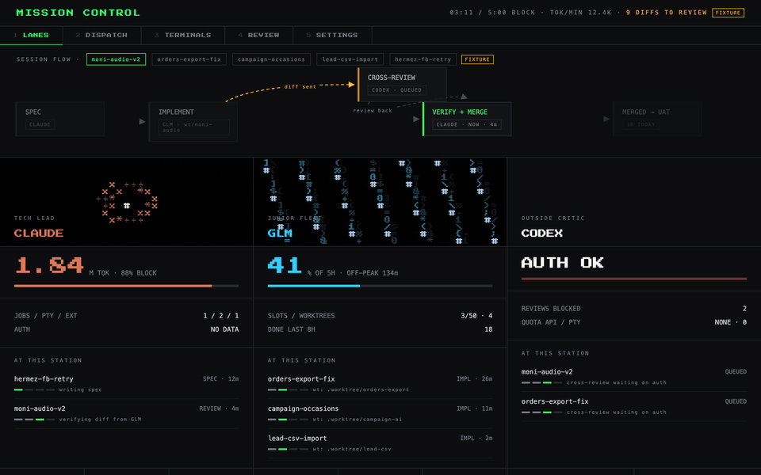

# Mission Control

**Run multiple AI coding agents like a dev team — from one browser tab.**

Mission Control is a self-hosted cockpit for developers who use more than one AI coding CLI. Point it at your engines — Claude Code, a GLM lane through any Anthropic-compatible endpoint (z.ai coding plan), OpenAI Codex CLI — and get live quota dashboards, one-click job dispatch, real terminals in the browser, and a review queue for everything your agents produce.



## Why

If you run several AI coding subscriptions, you know the drill: five terminal tabs, no idea which quota is burning, agent output scattered across worktrees, and "what did the overnight run actually finish?" answered by archaeology. Mission Control puts the whole operation on one screen:

- **Which engine is healthy, and how much quota is left** — before you dispatch, not after the rate-limit hits.
- **What every task is doing right now** — a live session-flow graph tracks each piece of work across engines: spec → implement → cross-review → verify → merged.
- **Where the results are** — completed diffs land in a review queue instead of vanishing into scrollback.

## Features

🎛 **Lanes dashboard** — one card per engine: live quota (Claude 5-hour block via ccusage, GLM 5-hour window via the z.ai monitor API, Codex auth state), peak-hour countdown for discounted windows, running jobs and terminals, plus any engine sessions started *outside* the app, detected machine-wide.

🚀 **Headless dispatch** — fire `claude -p` / `codex exec` jobs into any git repo, stream logs live over SSE, kill runaway jobs, get a diff-stat the moment a job lands.

🖥 **Browser terminals** — full interactive TUIs (xterm.js ↔ pty over WebSocket): run Claude Code itself inside the cockpit, detach and reattach with scrollback replay, per-engine environment injected automatically.

🔍 **Review queue** — every completed job with a non-empty diff waits for a human, newest first, with a copy-paste command to open the work in context.

⚙️ **One settings page** — per-engine setup with connection tests; API tokens entered once, stored server-side with `0600` permissions, never echoed back to the browser.

📼 **Terminal-native look** — textmode/CRT aesthetic with animated engine mascots rendered by [textmode.js](https://code.textmode.art), motion by [anime.js](https://animejs.com). Dashboards shouldn't be boring.

## Quickstart

Requires [Bun](https://bun.sh) ≥ 1.2.

```sh
git clone https://github.com/LynchzDEV/mission-control.git
cd mission-control
bun install
bun run start        # → http://127.0.0.1:7777
```

First visit: create a password (argon2id, min 10 chars). Then:

| Engine | Setup |
|---|---|
| Claude Code | Works out of the box if `claude` is installed and logged in |
| GLM | Settings → paste your z.ai coding-plan API key (or any Anthropic-compatible endpoint + token) |
| Codex | `codex login` once in any terminal |

```sh
bun test             # full suite — runs offline, no engine CLIs needed
```

## Architecture

```
Bun + Elysia (TypeScript end to end)
├── server-rendered JSX views (@kitajs/html) — no client framework
├── client "islands" transpiled per-request by Bun.build — no bundler, no build step
├── bun-pty ↔ xterm.js over WebSocket for terminals
├── SSE for live job logs
└── JSON state in ~/.config/mission-control — no database
```

The repo contains zero handwritten `.js` — TypeScript everywhere, transpiled at serve time.

## Security

- Binds `127.0.0.1` by default. Widening (e.g. to a Tailscale IP) is a deliberate settings change — authentication stays mandatory on every route and WebSocket upgrade either way.
- Sessions are HMAC-signed httpOnly cookies; login is rate-limited (5 failures → 60s lockout).
- Tokens and secrets: `~/.config/mission-control/` (`0700` dirs, `0600` files), passed to engines via environment only — never argv, never API responses, never client code.
- Jobs and terminals only run in directories that resolve (post-symlink) under `$HOME`; traversal attempts are rejected.

## Docs

- [`docs/SPEC.md`](docs/SPEC.md) — full engineering contract
- [`docs/decisions/`](docs/decisions/) — recorded runtime decisions (e.g. why bun-pty over node-pty under Bun)
- [`design/`](design/) — the design mockups and decision record the UI is ported from

## Contributing

Issues and PRs welcome. Before submitting: `bun test` must stay green, TypeScript only, no new runtime dependencies without a note in `docs/decisions/`, and follow the existing conventional-commit style.

## License

[MIT](LICENSE)
