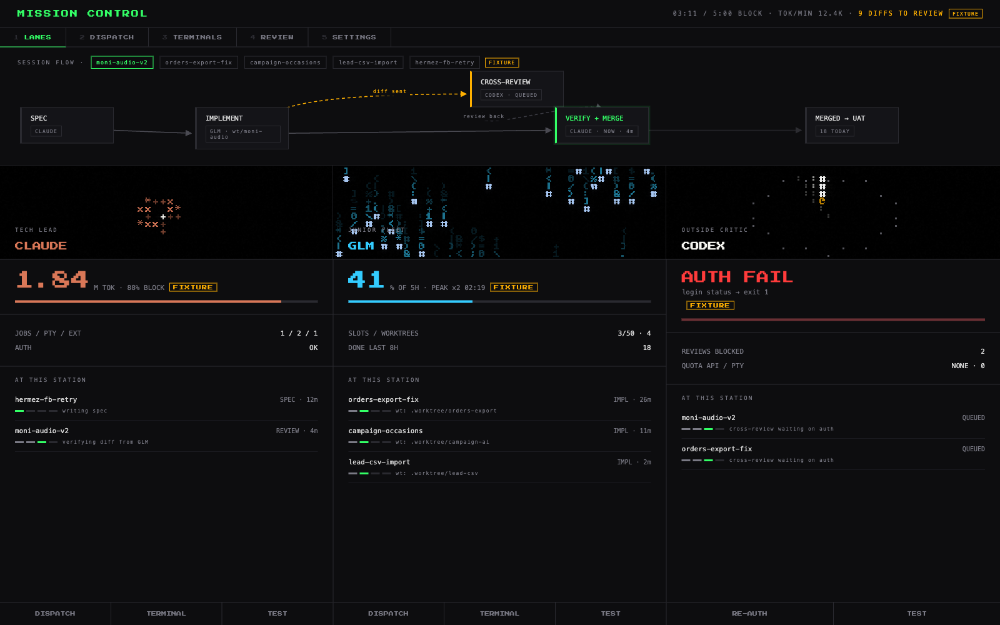
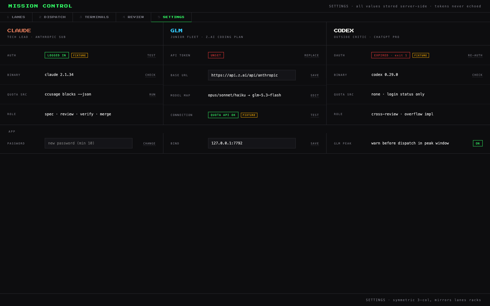

# Mission Control

Local web cockpit for running three AI coding engines like a small dev team — from one browser tab.

| Lane | Engine | Role |
|---|---|---|
| **CLAUDE** | Claude Code (Anthropic sub) | Tech lead — specs, review, verify, merge |
| **GLM** | Claude Code harness → z.ai coding plan (GLM-5.3-Flash) | Junior fleet — parallel ticket implementation, overnight runs |
| **CODEX** | OpenAI Codex CLI (ChatGPT plan) | Outside critic — cross-family review, overflow implementation |



## What it does

- **LANES** — engine health at a glance: live quota (ccusage for Claude, z.ai monitor API for GLM, login status for Codex), GLM peak-hours countdown, running jobs/terminals, external sessions detected machine-wide, animated textmode mascots per lane, and a **session-flow node graph** tracking each task SPEC → IMPLEMENT → CROSS-REVIEW → VERIFY → MERGED across engines.
- **DISPATCH** — fire headless jobs (`claude -p` / `codex exec`) into any git repo under `$HOME`, live SSE log streaming, kill button, diff-stat on completion.
- **TERMINALS** — real interactive TTYs in the browser (xterm.js ↔ bun-pty over WebSocket): full Claude Code / Codex TUIs, reattach with scrollback replay, per-engine env injection.
- **REVIEW** — morning queue of completed diffs awaiting human review.
- **SETTINGS** — symmetric per-engine config; z.ai token entered once, stored server-side (0600), never echoed back.

## Stack

Bun · Elysia · TypeScript everywhere (client islands transpiled at request time via `Bun.build` — zero build step, zero bundler, zero `.js` in the repo) · server-rendered JSX (`@kitajs/html`) · bun-pty · xterm.js · [textmode.js](https://code.textmode.art) mascots · [anime.js](https://animejs.com) motion. No framework, no database — JSON state under `~/.config/mission-control/`.

## Run

```sh
bun install
bun run start        # http://127.0.0.1:7777
```

First visit: set a password (min 10 chars, argon2id). Then Settings → paste your z.ai coding-plan API key to light up the GLM lane. Codex lane needs `codex login` done once in any terminal.

```sh
bun test             # full suite, offline, MC_FAKE_ENGINES built in
```

## Security posture

- Binds `127.0.0.1:7777` by default; widen deliberately (e.g. a Tailscale IP) via Settings — auth stays mandatory on every route and WS upgrade.
- Session = HMAC-signed httpOnly cookie; login rate-limited (5 fails → 60s).
- Secrets live in `~/.config/mission-control/` (dir 0700, files 0600), reach spawned engines via env only — never argv, never API responses, never client JS.
- Job/terminal working dirs validated by realpath under `$HOME` (traversal + symlink escapes rejected).

## Design provenance

UI is a 1:1 port of an approved design iteration — mockups, decision record, and locked design language live in [`design/`](design/) (`DECISION.md` for what's locked and why). Engineering contract: [`docs/SPEC.md`](docs/SPEC.md). Runtime choices (why bun-pty, why no tsconfig): [`docs/decisions/runtime-spike.md`](docs/decisions/runtime-spike.md).


