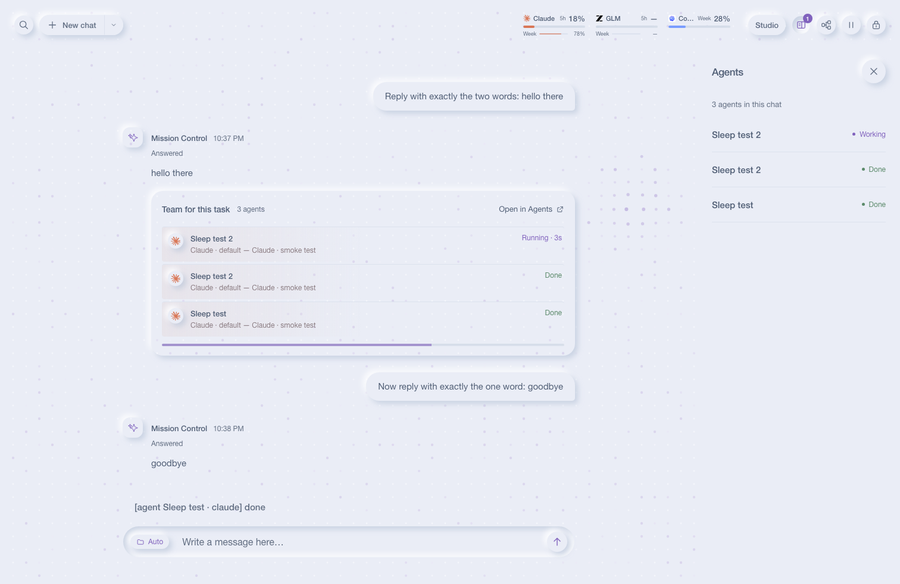

# Mission Control

**Talk to one chat; it runs your coding agents.**

Mission Control is a self-hosted workspace for Claude Code, GLM through an Anthropic-compatible endpoint, OpenAI Codex CLI and any ACP agent you connect. You describe the work in a chat; the chat picks the AIs, spawns agents in isolated worktrees, has a different AI family review every change, and lands it. Live terminals, a workflow Studio and one History sit on the same screen.



## Why

- **One place to ask.** The chat answers directly and turns work into agents on its own; each reply shows its team as a card with live state.
- **Nothing lands unreviewed.** Every code change is reviewed by a different AI family before the chat cherry-picks it onto your branch.
- **Terminals when you want them.** Claude Code, GLM and Codex run as real terminals beside the chat: several at once, split side by side.
- **Nothing gets lost.** History holds chats, live terminals, earlier Claude Code sessions and outside sessions in one list.

## Features

### Chat

Write in the message box. The folder chip picks the project (or leave it on Auto and the chat works it out); opening it shows the AI chip and the pencil chip that lets the chat edit files directly. Answers stream with a quiet activity line ("Worked 18s · used 4 tools"). When the chat spawns agents, the reply grows a team card: one row per agent with its AI, model, reason, latest activity and state (Running, In review, Landed, Needs you). Agents report back into the chat by themselves; a failure or a question shows as **Needs you** and a macOS notification. **Open in Agents** shows the chat's agents in a drawer where you can reply to one or stop it. The chat retries a failed step up to three attempts, each on a different AI, and never pushes or deploys.

### Terminals

**New chat ▾ → Terminal** opens a terminal with any connected AI in any folder under your home. The rail on the left lists sessions with a live dot and the latest output line; double-click a name to rename, × to end (with a confirm). Drag a card onto the terminal to open it beside or below. ⌘F finds in the terminal, links are clickable, and dropping files types their quoted paths at the prompt. The rail folds away with its arrow.

### Studio

Studio (top right) builds workflows: describe one and an AI drafts it, or start from the default, a template or scratch. Steps sit on a canvas with success, failure and needs-help branches; each step says who does it (**Chat decides**, or a pinned AI and model), its tools, skills and acceptance checks. Runs shows every run with its attempts, evidence and checks; Rules holds the core prompt every step follows; Manage AIs adds ACP, OpenCode or headless-CLI agents and the z.ai settings for GLM.

### History

The spyglass opens one list of chats, live terminals, earlier Claude Code sessions (resume one in a terminal) and outside Claude or Codex sessions; Mission Control's own agents never show up as outside sessions. Click the spyglass again to go back.

### Provider usage

The header shows every provider's usage in the same position: a five-hour window with weekly usage underneath for Claude and GLM, and the weekly window alone for Codex, which has no five-hour limit. Reset times appear on hover, and a value observed more than a few minutes ago carries its age. More than three providers scroll slowly.

| Provider | Usage source |
|---|---|
| Claude Code | The `ccstatusline` cache when it is under twelve hours old, otherwise a labeled `ccusage` estimate refreshed at most every fifteen minutes |
| GLM | Five-hour and monthly usage from the z.ai monitor API; weekly usage is unavailable |
| Codex | Weekly window reported by the Codex CLI account API |

### Access

The lock button shows the address, the API token for scripts and the dispatch skill (reveal, copy, rotate) and **Chat home**, the folder that holds your projects (never your home folder itself). The old Main, Dispatch, Review, Terminals and Settings addresses redirect to the one screen.

## Quickstart

Requires [Bun](https://bun.sh) ≥ 1.2.

```sh
git clone https://github.com/LynchzDEV/mission-control.git
cd mission-control
bun install
bun run start
```

Open [Mission Control](http://127.0.0.1:7777). Then:

| Engine | Setup |
|---|---|
| Claude Code | Works out of the box if `claude` is installed and logged in |
| GLM | Studio → Manage AIs → paste your z.ai coding-plan API key (or any Anthropic-compatible endpoint + token) |
| Codex | `codex login` once in any terminal |

```sh
bun test
```

The test suite runs offline without engine CLIs.

## Claude Code skill

Installing Mission Control also installs the `mc-dispatch` orchestration skill into Claude Code. The skill carries an acceptance baseline for every worker: run the specs you touched or that reference your change (never the full suite), no forced waits and no warnings or errors in the output, and nothing on the remote lost or made incompatible, with evidence in the completion note. The orchestrator runs the full suite or `bin/ci` once, at landing. `bun install` (or the first cockpit start) links `~/.claude/skills/mc-dispatch` to `skills/mc-dispatch` in this repo — so the skill is a symlink, and `git pull` updates it with no further action. An existing hand-written copy at that path is never overwritten: it is moved aside to `~/.claude/skills-backup/mc-dispatch.pre-mission-control-<timestamp>` before the link is created — deliberately outside `skills/`, so Claude Code never loads the backup as a second skill.

On `bun install` and every cockpit start, Mission Control translates Claude's global instructions, skills and Markdown agents for Codex, skipping incompatible orchestration assets while keeping clean skills and supporting resources symlinked. Generated instructions and translated skills are real files, displaced personal assets are preserved under `~/.codex/backup/`, and unchanged output keeps its mtime; GLM continues to share `~/.claude`, while isolated worker profiles stay slim.

## Architecture

```
Bun + Elysia (TypeScript end to end)
├── one server-rendered shell; Studio is a React island
├── client "islands" bundled on demand by Bun.build — no separate build step
├── bun-pty ↔ xterm.js over WebSocket for terminals
├── SSE for live job logs
└── JSON state in ~/.config/mission-control — no database
```

The application is written in TypeScript and CSS; client bundles are cached until their source changes. Transcripts come straight from the engines' own session logs (`~/.claude/projects` JSONL and `~/.codex/sessions` rollouts) and are parsed once per file change. JetBrains Mono ships with the app under the OFL. Design studies live in `docs/design/` (`quiet-chat` is the source of the 2.0 look).

## Security

- Binds `127.0.0.1` only; the port comes from `MISSION_CONTROL_PORT` (default 7777). Anyone who can open a connection to 127.0.0.1 on this machine has full control, including other OS user accounts and every agent job Mission Control spawns. Browsers are additionally limited by a Host/Origin/Fetch-Metadata guard, so a web page from another origin cannot read or drive the app. The API token is kept for scripts and the dispatch skill; it grants nothing extra to local callers. Health and static assets are public.
- Credentials are stored in `~/.config/mission-control/` (`0700` dirs, `0600` files). Provider credentials are passed to engines through their environment. The Access dialog can reveal or rotate the cockpit API token.
- Jobs and terminals only run in directories that resolve (post-symlink) under `$HOME`; traversal attempts are rejected.

## Docs

- [`docs/SPEC.md`](docs/SPEC.md) — full engineering contract
- [`docs/decisions/`](docs/decisions/) — recorded runtime decisions (e.g. why bun-pty over node-pty under Bun)
- [`docs/decisions/system-chat.md`](docs/decisions/system-chat.md) — how the chat works: engine, folders, autonomy, team, history
- [`docs/superpowers/plans/2026-09-24-v2-roadmap.md`](docs/superpowers/plans/2026-09-24-v2-roadmap.md) — the 2.0 roadmap and its phase plans
- [`docs/design/`](docs/design/) — design studies: the new quiet design (`quiet-chat`), its chat, launcher and Terminals studies, the earlier overhaul and Studio prototypes
- [`docs/new-design-port-status.md`](docs/new-design-port-status.md) — every current feature tracked against the new design
- [`assets/`](assets/) — theme tokens used by the design studies, and vendored scripts copied into `public/vendor/` on install

## Contributing

Issues and PRs welcome. Before submitting: `bun test` must stay green, TypeScript only, no new runtime dependencies without a note in `docs/decisions/`, and follow the existing conventional-commit style.

## License

[MIT](LICENSE)
