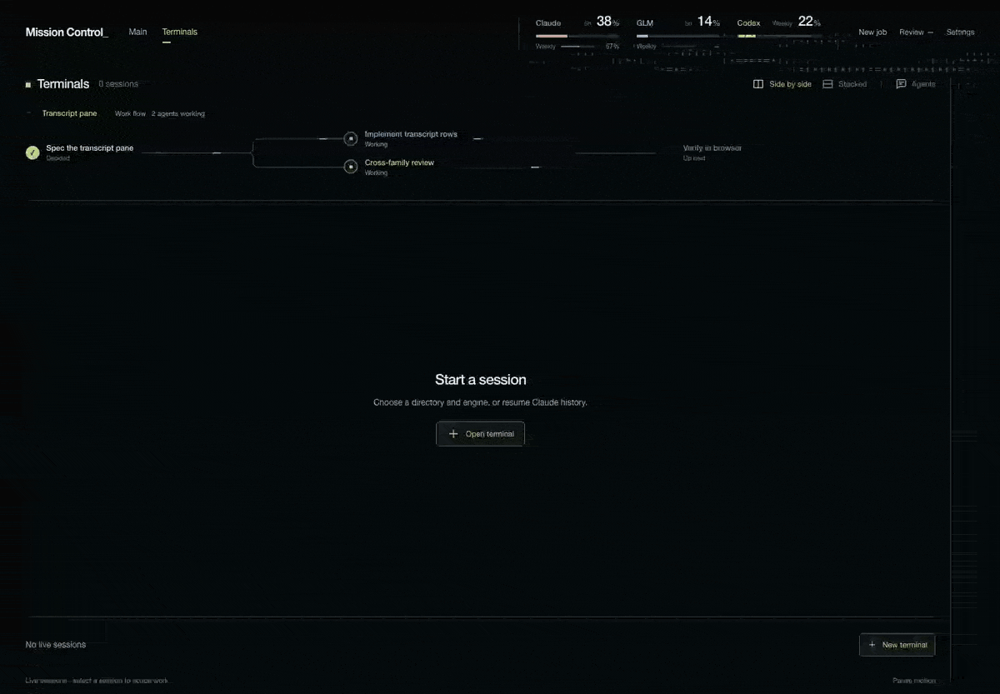

# Mission Control

**Your terminals, coding agents, and work in one browser tab.**

Mission Control is a self-hosted workspace for Claude Code, GLM through an Anthropic-compatible endpoint, and OpenAI Codex CLI. Open interactive terminals, follow the agents working on the selected session, check provider usage, and review completed work without losing your terminal context.



*Recorded from the app with sample sessions, agent output, and usage values. [View the still image](docs/images/workspace.png).*

## Why

When work spans several coding agents, terminal output, usage limits, and review results are easy to lose track of. Mission Control keeps them together:

- **Stay in your terminal.** Visit Main, Usage, Review, or Settings and return to the same sessions and scrollback.
- **See the current work.** A branched flow and individual activity windows show the active agents associated with the selected terminal.
- **Find the results.** Search conversations and plans, inspect changes, and acknowledge reviews in one work navigator.

## Features

### Terminal workspace

Run full interactive CLI interfaces through xterm.js and a terminal connection over WebSocket. Arrange up to four panes side by side or stacked, drag the dividers, focus a session, rename tabs, reconnect, or resume Claude history. Navigation preserves the live terminal connections.

The workspace fills the available screen width and height. Narrow screens display the selected pane while retaining the saved split layout. Larger screens give agent activity its own side rails; longer lists scroll within their space. The ASCII background can be paused and respects reduced-motion preferences.

### Flow and agent conversations

Follow a manual plan or a flow built from the selected terminal's linked conversations. Each active conversation has its own window showing the latest tool, activity, and state. Open the full conversation for detail. Replies and automatic reviews stay with their originating conversation.

### Provider usage

The header puts every provider's five-hour usage in the same position, with weekly usage underneath. The Usage page adds reset times and available accounting details.

| Provider | Usage source |
|---|---|
| Claude Code | Fresh `ccstatusline` cache when available; a labeled `ccusage` estimate otherwise |
| GLM | Five-hour and monthly usage from the z.ai monitor API; weekly usage is unavailable |
| Codex | Five-hour and weekly windows reported by the Codex CLI account API |

Missing or unsupported windows display **Unavailable**. Claude cost and token estimates remain separate from reported quota limits.

### Work, dispatch, and review

Search and filter conversations and plans in Main. Dispatch background `claude -p` or `codex exec` jobs, optionally in isolated worktrees; follow streamed output, reply with follow-up work, or stop a running job. Review completed changes, mark them reviewed, and land finished worktrees through the existing landing action.

### Settings

Configure engines and the plan, execute, and review roles; choose models and automatic review behavior; and test connections. Saved defaults refresh in the workspace while preserving forms you have already started editing.

## Quickstart

Requires [Bun](https://bun.sh) ≥ 1.2.

```sh
git clone https://github.com/LynchzDEV/mission-control.git
cd mission-control
bun install
bun run start
```

Open [Mission Control](http://127.0.0.1:7777). On your first visit, create a password (argon2id, minimum 10 characters). Then:

| Engine | Setup |
|---|---|
| Claude Code | Works out of the box if `claude` is installed and logged in |
| GLM | Settings → paste your z.ai coding-plan API key (or any Anthropic-compatible endpoint + token) |
| Codex | `codex login` once in any terminal |

```sh
bun test
```

The test suite runs offline without engine CLIs. To regenerate the static development preview on the existing server, run `bun scripts/render-ui-preview.ts` and open `/ui-preview/terminals.html`. Generated preview files are ignored by Git; the preview uses the server's work data, with Settings writes disabled.

## Claude Code skill

Installing Mission Control also installs the `mc-dispatch` orchestration skill into Claude Code. `bun install` (or the first cockpit start) links `~/.claude/skills/mc-dispatch` to `skills/mc-dispatch` in this repo — so the skill is a symlink, and `git pull` updates it with no further action. An existing hand-written copy at that path is never overwritten: it is moved aside to `~/.claude/skills-backup/mc-dispatch.pre-mission-control-<timestamp>` before the link is created — deliberately outside `skills/`, so Claude Code never loads the backup as a second skill.

On `bun install` and every cockpit start, Mission Control translates Claude's global instructions, skills and Markdown agents for Codex, skipping incompatible orchestration assets while keeping clean skills and supporting resources symlinked. Generated instructions and translated skills are real files, displaced personal assets are preserved under `~/.codex/backup/`, and unchanged output keeps its mtime; GLM continues to share `~/.claude`, while isolated worker profiles stay slim.

## Architecture

```
Bun + Elysia (TypeScript end to end)
├── server-rendered JSX views (@kitajs/html) — no client framework
├── client "islands" bundled on demand by Bun.build — no separate build step
├── bun-pty ↔ xterm.js over WebSocket for terminals
├── SSE for live job logs
└── JSON state in ~/.config/mission-control — no database
```

The application is written in TypeScript and CSS; client bundles are cached until their source changes. Standalone design studies and their capture tools live in `visualizer/ui-overhaul/`.

## Security

- Binds `127.0.0.1` by default. Widening (e.g. to a Tailscale IP) is a deliberate settings change. Workspace data, actions, and terminal WebSocket connections require authentication; health, login/setup, and static client assets are public.
- Sessions are HMAC-signed httpOnly cookies; login is rate-limited (5 failures → 60s lockout).
- Credentials are stored in `~/.config/mission-control/` (`0700` dirs, `0600` files). Provider credentials are passed to engines through their environment. Settings can explicitly reveal or rotate the separate cockpit API token after authentication.
- Jobs and terminals only run in directories that resolve (post-symlink) under `$HOME`; traversal attempts are rejected.

## Docs

- [`docs/SPEC.md`](docs/SPEC.md) — full engineering contract
- [`docs/decisions/`](docs/decisions/) — recorded runtime decisions (e.g. why bun-pty over node-pty under Bun)
- [`visualizer/ui-overhaul/terminal-components.html`](visualizer/ui-overhaul/terminal-components.html) — the approved terminal component study
- [`docs/decisions/ui-overhaul-verification.md`](docs/decisions/ui-overhaul-verification.md) — visual checks, responsive behavior, and known differences from the study
- [`design/`](design/) — shared theme tokens and earlier design records

## Contributing

Issues and PRs welcome. Before submitting: `bun test` must stay green, TypeScript only, no new runtime dependencies without a note in `docs/decisions/`, and follow the existing conventional-commit style.

## License

[MIT](LICENSE)
